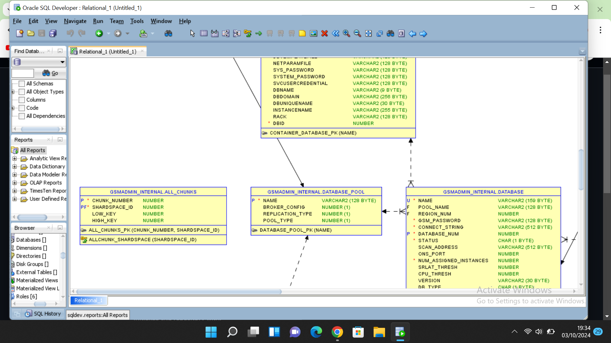

# Description:
The provided SQL script establishes a basic e-commerce database consisting of three key tables: customers, orders, and products.

## Customers Table

This table contains vital information about the customers who interact with the e-commerce platform. Each entry includes a unique customer_id, customer_name, address, city, state, and zip code. This structure allows the platform to effectively manage customer information, facilitating communication, shipping, and personalized services.

## Products Table
This table holds details about the products available for purchase on the platform. Each product entry includes a unique product_id, product_name, price, and quantity in stock. This information is essential for inventory management, ensuring that customers can see what is available for order and helping to track product availability.

## Orders Table
The orders table connects customers to their purchases, featuring a unique order_id, customer_id (which references the customer placing the order), order_date, and order_status. This table is crucial for tracking customer transactions, managing the order lifecycle, and analyzing sales data.

# CREATING TABLES
```    sql
CREATE TABLE customers (
    customer_id NUMBER PRIMARY KEY,
    customer_name VARCHAR2(100),
    address VARCHAR2(200),
    city VARCHAR2(100),
    state VARCHAR2(100),
    zip VARCHAR2(20)
);
```
```sql
CREATE TABLE orders (
    order_id NUMBER PRIMARY KEY,
    customer_id NUMBER REFERENCES customers(customer_id),
    order_date DATE,
    order_status VARCHAR2(50)
);
```
```sql
CREATE TABLE products (
    product_id NUMBER PRIMARY KEY,
    product_name VARCHAR2(100),
    price NUMBER,
    quantity NUMBER
);
```
## INSERTING DATA
-- Insert random data into customers table
```sql
INSERT INTO customers (customer_id, customer_name, address, city, state, zip) VALUES (1, 'John Doe', '123 Main St', 'Springfield', 'IL', '62701');
INSERT INTO customers (customer_id, customer_name, address, city, state, zip) VALUES (2, 'Jane Smith', '456 Elm St', 'Springfield', 'IL', '62702');
INSERT INTO customers (customer_id, customer_name, address, city, state, zip) VALUES (3, 'Alice Johnson', '789 Oak St', 'Champaign', 'IL', '61820');
INSERT INTO customers (customer_id, customer_name, address, city, state, zip) VALUES (4, 'David Brown', '101 Maple St', 'Peoria', 'IL', '61602');
INSERT INTO customers (customer_id, customer_name, address, city, state, zip) VALUES (5, 'Emily Davis', '202 Pine St', 'Naperville', 'IL', '60540');
INSERT INTO customers (customer_id, customer_name, address, city, state, zip) VALUES (6, 'Michael Lee', '303 Birch St', 'Rockford', 'IL', '61101');
INSERT INTO customers (customer_id, customer_name, address, city, state, zip) VALUES (7, 'Sophia Clark', '404 Cedar St', 'Evanston', 'IL', '60201');
INSERT INTO customers (customer_id, customer_name, address, city, state, zip) VALUES (8, 'James Wilson', '505 Willow St', 'Peoria', 'IL', '61603');
INSERT INTO customers (customer_id, customer_name, address, city, state, zip) VALUES (9, 'Olivia Taylor', '606 Walnut St', 'Bloomington', 'IL', '61701');
INSERT INTO customers (customer_id, customer_name, address, city, state, zip) VALUES (10, 'Liam Martinez', '707 Ash St', 'Schaumburg', 'IL', '60173');

```
-- Insert random data into products table
```sql 
INSERT INTO products (product_id, product_name, price, quantity) VALUES (1, 'Wireless Mouse', 25.99, 100);
INSERT INTO products (product_id, product_name, price, quantity) VALUES (2, 'Mechanical Keyboard', 75.50, 50);
INSERT INTO products (product_id, product_name, price, quantity) VALUES (3, 'USB-C Hub', 30.00, 150);
INSERT INTO products (product_id, product_name, price, quantity) VALUES (4, 'Gaming Headset', 60.99, 75);
INSERT INTO products (product_id, product_name, price, quantity) VALUES (5, 'HDMI Cable', 15.49, 200);
INSERT INTO products (product_id, product_name, price, quantity) VALUES (6, 'Wireless Charger', 20.00, 80);
INSERT INTO products (product_id, product_name, price, quantity) VALUES (7, 'Webcam', 50.00, 60);
INSERT INTO products (product_id, product_name, price, quantity) VALUES (8, 'Laptop Stand', 40.99, 40);
INSERT INTO products (product_id, product_name, price, quantity) VALUES (9, 'Portable SSD', 120.00, 30);
INSERT INTO products (product_id, product_name, price, quantity) VALUES (10, 'Smartphone Holder', 10.99, 150);
```
-- Insert random data into orders table
```sql
INSERT INTO orders (order_id, customer_id, order_date, order_status) VALUES (1, 1, TO_DATE('2024-09-01', 'YYYY-MM-DD'), 'Shipped');
INSERT INTO orders (order_id, customer_id, order_date, order_status) VALUES (2, 2, TO_DATE('2024-09-02', 'YYYY-MM-DD'), 'Delivered');
INSERT INTO orders (order_id, customer_id, order_date, order_status) VALUES (3, 3, TO_DATE('2024-09-03', 'YYYY-MM-DD'), 'Processing');
INSERT INTO orders (order_id, customer_id, order_date, order_status) VALUES (4, 4, TO_DATE('2024-09-04', 'YYYY-MM-DD'), 'Shipped');
INSERT INTO orders (order_id, customer_id, order_date, order_status) VALUES (5, 5, TO_DATE('2024-09-05', 'YYYY-MM-DD'), 'Cancelled');
INSERT INTO orders (order_id, customer_id, order_date, order_status) VALUES (6, 6, TO_DATE('2024-09-06', 'YYYY-MM-DD'), 'Delivered');
INSERT INTO orders (order_id, customer_id, order_date, order_status) VALUES (7, 7, TO_DATE('2024-09-07', 'YYYY-MM-DD'), 'Shipped');
INSERT INTO orders (order_id, customer_id, order_date, order_status) VALUES (8, 8, TO_DATE('2024-09-08', 'YYYY-MM-DD'), 'Processing');
INSERT INTO orders (order_id, customer_id, order_date, order_status) VALUES (9, 9, TO_DATE('2024-09-09', 'YYYY-MM-DD'), 'Delivered');
INSERT INTO orders (order_id, customer_id, order_date, order_status) VALUES (10, 10, TO_DATE('2024-09-10', 'YYYY-MM-DD'), 'Shipped');
```


## Conclusion:
The establishment of this e-commerce database provides a solid foundation for managing customer relationships, product inventories, and order processing. By organizing data into distinct tables with well-defined relationships, the database enables efficient data management and retrieval.
